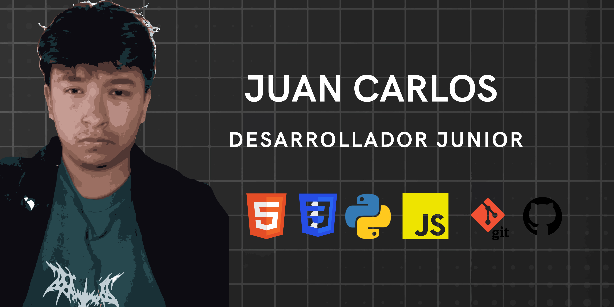

<!-- SALUDO Y ROL -->
<h1 align="center">¡Hola! 👋 Mi nombre es JUAN CARLOS</h1>
<h3 align="center">Desarrollador Junior</h3>

---
<!-- BANNER PRINCIPAL -->

  

<!-- DESCRIPCIÓN BREVE -->
### 🚀 Sobre mí

- 🔭 Actualmente estoy trabajando en **Proyecto Bibliotecario FIVC**
- 🌱 Estoy aprendiendo **JavaScript, Python, Java, C++, HTML, CSS y Git**
- 💬 Pregúntame sobre **Desarrollo de Software y Lógica de Programación**
- ⚡ Dato curioso: **Apasionado por crear tecnología y aprender nuevas herramientas**

---

<!-- REDES SOCIALES Y CONTACTO -->
### 📬 Encuéntrame en:

  
  
  

---

<!-- LENGUAJES Y HERRAMIENTAS -->
### 🛠️ Lenguajes y Herramientas:

  
  
  
  
  
  
  

---

<!-- ESTADÍSTICAS AUTOMÁTICAS DE GITHUB -->
<!-- ESTADÍSTICAS AUTOMÁTICAS DE GITHUB -->
### 📊 Mis Estadísticas en GitHub

  
    
  

<!-- ALTERNATIVA DE ESTADÍSTICAS -->

  

